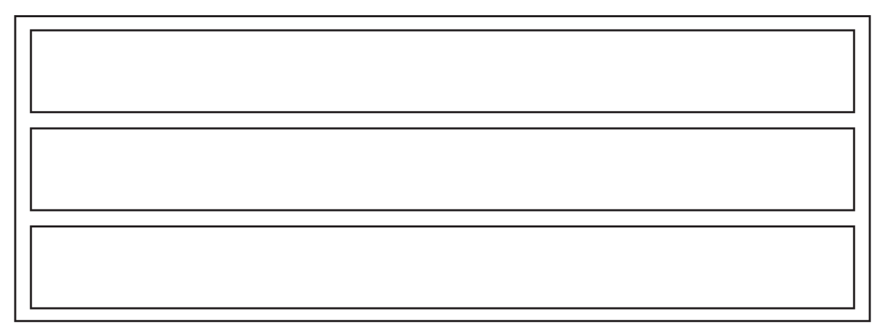
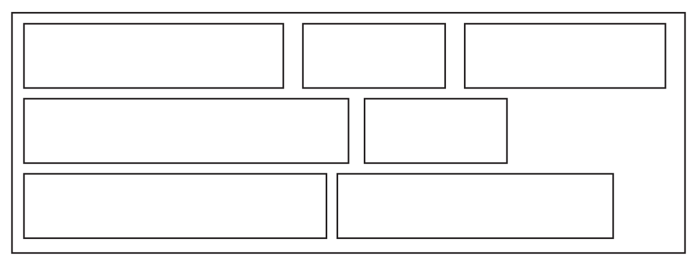

# CSS Layout
By default elements display in one of two ways: `block` or `inline`. This controls how they site with each other on the page, how they set their default size, and the ways we can change their size and position.

# Block
Block elements begin on a new line, and take up the width of their container.



Block elements can have their width and height set by the `width` and `height` properties although, even if there is space around them other block elements will not sit next to them by default.

# Inline
Inline elements begin on the same line as the previous inline element, if there's space, and don’t take up any more space than they need. They will wrap onto new lines if they reach the edge of their container.

Inline elements behave like individual words in a sentence or paragraph.



Inline elements cannot generally have their size set with `width` or `height`, and the `padding` and `margin` properties will only affect their sizing or position to the left and right, rather than the top and bottom. Padding will, however, affect how much space the background colour takes up, so can be used to make them appear more blocky than they otherwise would.

# Display
Changing the `display` property of elements can adjust their default.

To set an element to be `inline`, we use `display: inline;`

To set an element to be `block`, we use `display: block;`

# Hybrid - inline-block
There is a hybrid value available for the `display` property: `inline-block`. This allows the elements to sit next to each other, like words or `inline` elements, but also allows them to be sized explicitly, like `block` elements.

```css
span{
	display: inline-block;
}
```

Like `inline` elements, `inline-block` elements will maintain white space between them. This means that if there's a space or a line break between the html tags of two `inline-block` elements there will be a small gap rendered between them on the page.

# Vertical Alignment
The `vertical-align` property can be used to set the way that `inline` and `inline-block` elements line up. There are a number of different values, the most commonly useful are these

- `baseline`: aligns elements to the baseline of the text in their parent, i.e. to the line on which the letters sit
- `text-top`: aligns elements to the top of the font in the parent element
- `middle`: aligns the middle (top to bottom) of the elements with the middle (top to bottom) of their parent
- `top`: aligns the elements to the top of all other elements in their line
- `bottom`: aligns the elements to the bottom of all other elements in their line

# Float
The float property can be used to detach elements from their normal flow, so that they try to float to either the left or the right of the screen. This will cause text to wrap around the item, it will also allow two (or more) floated elements to sit next to each other. Even if they are block elements.

We can use this, for example, to create two columns. If there are two `<div>` elements on a page, next to each other in the code we can use this css:

```css
div{
	width: 50%;
	float: left;
}
```
# Modernisation
The use of `float`s for column layouts is a bit of a hack in terms of their original intention (allowing text to wrap around elements) but one that enabled a lot of complex layouts, similarly with `inline-block`. There are now better ways of creating multi column or grid based layouts such as the Flex Box and CSS Grid groups of rules, but `float` and `inline-block` remain functional and widely supported.
